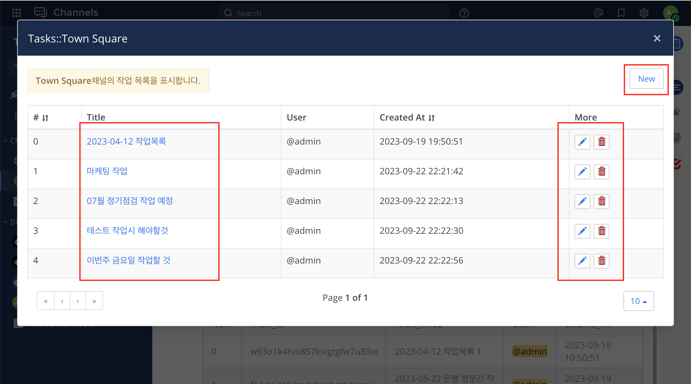
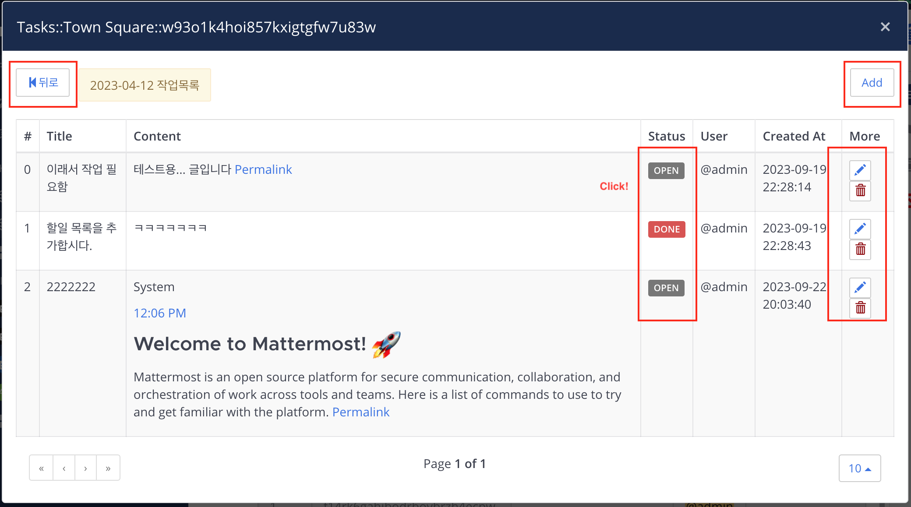
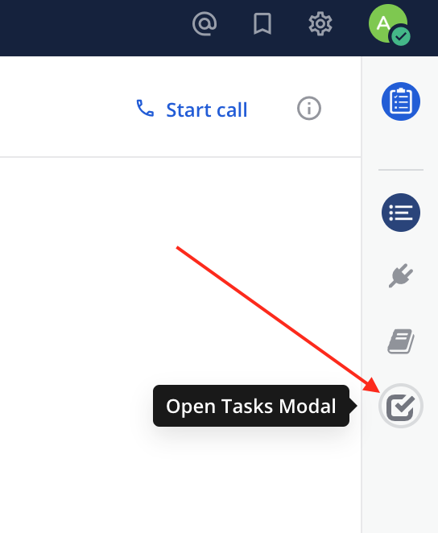
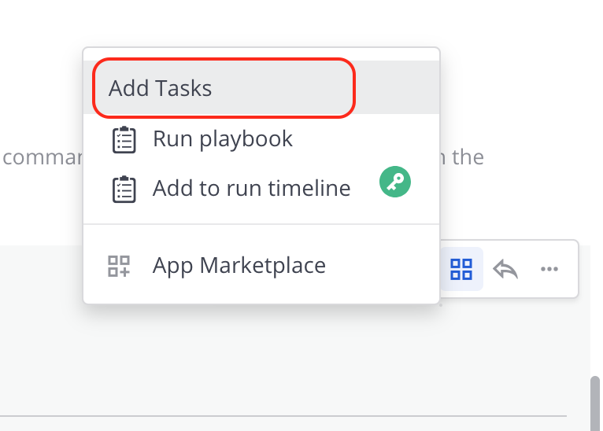

# Mattermost Tasks Plugin

Mattermost 채널에 작업목록을 추가합니다. 작업 목록에 새로운 할일을 추가합니다.

Add a Task to the Mattermost channel.





## 주요 기능
- 작업(task) 목록 관리
- 할일(job) 목록 관리

```
CHANNEL_#
├── TASK_A       ## Add Task
│   ├── JOB_1    ## Add Job
│   └── JOB_2
└── TASK_B
    ├──JOB_1
    ├──JOB_2
    └──JOB_3
```

## Install

플러그인을 사용하기 위해서 다음과 같이 작업합니다.

1. Go the releases page and download the [latest release](https://github.com/oming/mattermost-plugin-tasks/releases).
2. On your Mattermost, go to System Console -> Plugin Management and upload it.
3. Configure plugin settings as desired.
4. Start using the plugin!

## Usage

### UI

채널 헤더 버튼(Channel Header Button)을 클릭하여 Tasks 모달창을 열 수 있습니다. 
추가적으로 메시지 액션(Message Actions)를 통해 메시지를 할일(Job)으로 등록합니다.





### Slash Commands

슬래시 명령어를 통해 현재 설정된 작업을 확인 할 수 있습니다. 슬래시 명령어의 경우 기능이 제한 됩니다.

#### 채널의 작업 목록 출력

```
/tasks show
```

#### 채널의 새로운 작업 목록을 추가

```
/tasks new [task_title]
```

#### 채널의 작업 목록 제거

```
/tasks delete [#task_id]
```

#### 작업 목록 하위 할일 목록 출력

```
/tasks list [#task_id]
```

#### 작업 목록에 할일 목록 추가

```
/tasks add [#task_id] [job_title] [job_content]
```

#### 작업 목록의 할일 목록 삭제

```
/tasks remove [#task_id] [#job_id]
```

#### 작업 목록의 할일 목록의 상태 변경

```
/tasks status [#task_id] [#job_id] [open|done]
```

### 데이터

```json
channel_o4mags5xstn68e3tu3bgfn1h1e
[
    {
      "task_id": "7unze9mpeibwjxqdgmqromo65y",
      "task_title": "채널 작업목록 1번째",
      "user_id": "kzzfyp1dj7dmdp54ztcwq8bzde",
      "CreateAt": 1681644431306,
      "UpdateAt": 1681644431306,
      "DeleteAt": 0
    },
    {
      "task_id": "o4mags5xstn68e3tu3bgfn1h1e",
      "task_title": "채널 작업목록 2번째",
      "user_id": "kzzfyp1dj7dmdp54ztcwq8bzde",
      "CreateAt": 1681644431306,
      "UpdateAt": 1681644431306,
      "DeleteAt": 0
    }
]
```

```json
task_7unze9mpeibwjxqdgmqromo65y
[
    {
      "job_id": "sti6aff5ubgw5d1ihn76qgr3py",
      "job_title": "작업목록의 제목입니다.",
      "job_content": "실제 작업 내영의 내용이 들어갑니다.",
      "job_status": "done",
      "user_id": "kzzfyp1dj7dmdp54ztcwq8bzde",
      "CreateAt": 1681644431306,
      "UpdateAt": 1681644431306,
      "DeleteAt": 0
    },
    {
      "job_id": "hqb119f4iin3dec55yhnj7m3ye",
      "job_title": "작업목록의 제목입니다.",
      "job_content": "실제 작업 내영의 내용이 들어갑니다.",
      "job_status": "doing",
      "user_id": "kzzfyp1dj7dmdp54ztcwq8bzde",
      "CreateAt": 1681644431306,
      "UpdateAt": 1681644431306,
      "DeleteAt": 0
    }
]
```